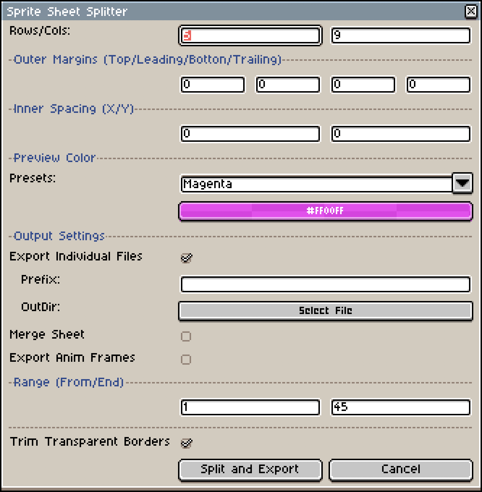

# Aseprite Sprite Sheet Splitter

A powerful and pixel-perfect Aseprite plugin for splitting sprite sheets into individual elements. Supports real-time preview, 4-way margin settings, and multiple export modes.

## ✨ Features

- **Real-time Visual Preview**: As you adjust parameters, cutting lines are displayed on the canvas in real-time, ensuring pixel-perfect accuracy and preventing clipping errors.
- **Flexible Margins & Spacing**: Supports independent settings for Top, Leading, Bottom, and Trailing outer margins, as well as custom row/column spacing (Gap X/Y).
- **Non-blocking Interaction**: The canvas can be freely zoomed and panned while the dialog is open, allowing for detailed inspection of every pixel.
- **Multiple Export Modes**:
  - **Export Individual Files**: Save each slice as a separate PNG file.
  - **Merge into New Sheet**: Rearrange slices into a specified M-row by N-column layout.
  - **Export as Animation Frames**: Automatically convert slices into animation frames in a new Aseprite file.
- **Auto-Trim**: Option to automatically remove transparent borders around each slice.
- **Customizable Preview**: Choose from several high-contrast preset colors or pick a custom color to ensure visibility against any background.
- **Compact UI**: Optimized layout to save screen space while providing full control.

## 🚀 Use Cases

- **Game Asset Extraction**: Split large sprite sheets into individual units or items.
- **Animation Sequence Conversion**: Convert horizontally/vertically arranged frames into Aseprite animation frames.
- **UI Component Slicing**: Precisely extract UI elements with specific margins and gaps.
- **Layout Reorganization**: Change the row/column structure of your assets for different engine requirements.

## 📋 Requirements

- **Aseprite Version**: Recommended v1.3.17 or higher.
- **Operating System**: Windows, macOS, Linux.

## 🛠️ How to Use

1. **Installation**:
   - Copy `SpriteSheetSplitter.lua` to your Aseprite scripts folder: `File -> Scripts -> Open Scripts Folder`.
   - Click `File -> Scripts -> Rescan Scripts Folder`.
2. **Running the Plugin**:
   - Open the sprite sheet you want to split.
   - Select `File -> Scripts -> SpriteSheetSplitter`.
3. **Configuration**:
   - **Rows/Cols**: Enter the number of rows and columns in the original sheet.
   - **Outer Margins**: Set pixel margins for the entire image edges.
   - **Inner Spacing**: Set pixel gaps between individual elements.
   - **Output Settings**: Choose your preferred export mode.
   - **Range**: (Optional) Specify a range of frames to process for Merge/Animation modes.
4. **Execution**: Click `Split and Export` to complete the process.

## 📄 License

This project is licensed under the [MIT License](LICENSE).
